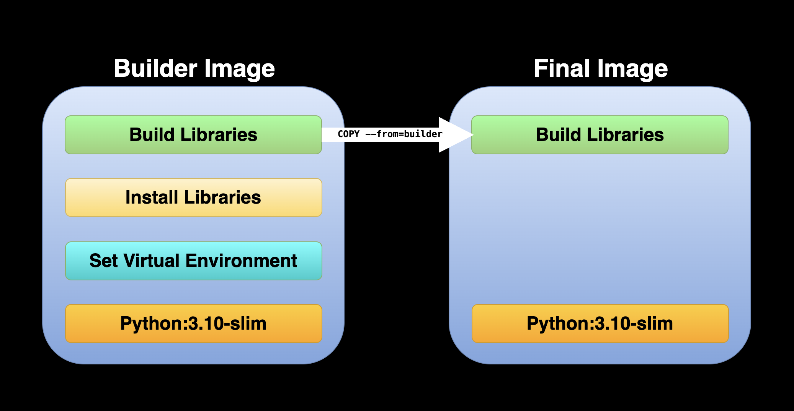

# Introduction to Multi-Stage Image Build for Python
This repo provides the code examples for this medium article. This includes the following three builds:
- [Dockerfile.base]() - baseline image using the defult Python 3.10 image (`python:3.10`)
- Dockerfile.slim - using the Python 3.10 slim image (`python:3.10-slim`)
- Dockerfile.multi-stage - example for multi-stage build 

<figure>
</a>
</figure>

## VScode Settings

This repo has Dev Containers setting to test the tutorial builds. See the `.devcontainer/devcontainer.json` file for more details.

## Resources

Additional resources for setting a Python development environment with VScode and the Dev Containers extension:
- Multi-Stage Builds: https://docs.docker.com/build/building/multi-stage/
- Setting A Dockerized Python Environment — The Elegant Way - https://medium.com/p/f716ef85571d
- Setting A Dockerized Python Environment — The Hard Way - https://towardsdatascience.com/setting-a-dockerized-python-environment-the-hard-way-e62531bca7a0

## License

This tutorial is licensed under a [Creative Commons Attribution-NonCommercial-ShareAlike 4.0 International](https://creativecommons.org/licenses/by-nc-sa/4.0/) License.
